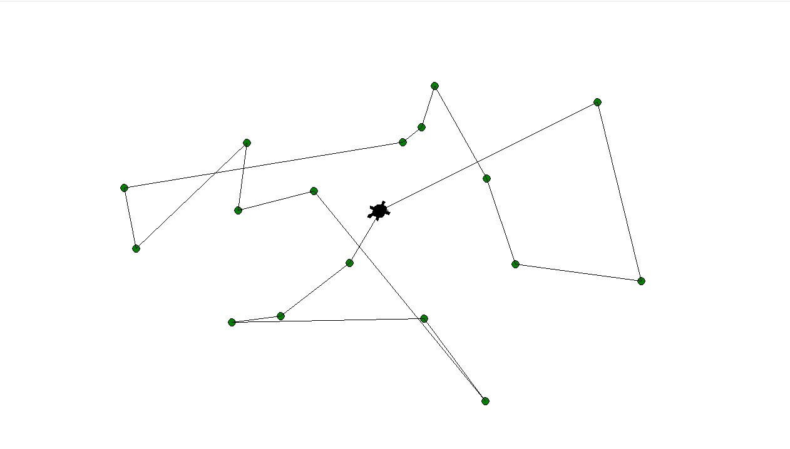

# Pathfinding Turtle

### I'm going to redo this once I have the time
#### TODO

- A* instead of Dijkstra
- Better UI front and backend
  - Add and delete individual nodes
  - Mark node for ignore
  - Graphical toggle for input states

## About

Let a turtle figure out approximate solutions to the [travelling salesman problem](https://en.wikipedia.org/wiki/Travelling_salesman_problem).

### Details

A Prim minimum spanning tree is generated between nodes.
Then, a Eulerian tour is generated from the tree and backtracing through visited nodes is replaced with the shortest path to the next unvisited node.

## Dependencies

Python 3.7

### numpy

`pip install numpy`

## Usage

Run `Sim.py`.

### Controls

Press `T` to toggle between target and obstacle mode.  
Press `C` to reset the application.

By default and after reset, the application is in target mode.

In target mode:

- Left click on the canvas to add a green target.
- Left click on a green target to start a optimized complete tour.
- Right click on green target to start a Prim MST tour.
- Middle click on a green target to move directly there.

In obstacle mode:

- Left click on the canvas to add an obstacle.

## TODO

- Refactor UI and application layer, since it was put together for active demonstration and not code review.
